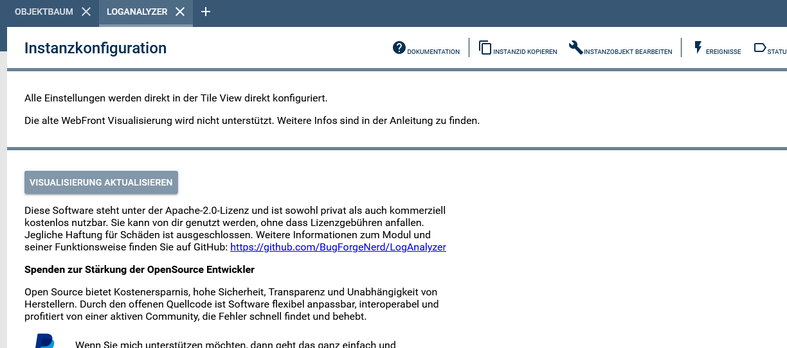

# LogAnalyzer – IPSView Edition

> **Diese Version ist die IPSView-Variante des LogAnalyzers.**  
> Statt der Tile-Kachelansicht wird die Ausgabe als HTML in eine **String-Variable mit dem Profil `~HTMLBox`** geschrieben.  
> Diese Variable kann direkt in **IPSView** als HTML-Box eingebunden werden.  
> Für die originale Tile View bitte das Original-Repository nutzen: https://github.com/BugForgeNerd/LogAnalyzer

Das Modul **LogAnalyzer** ermöglicht die Analyse und Filterung von IP-Symcon Logdateien – in dieser Edition über eine HTML-Box für IPSView.  
Logeinträge können gefiltert, durchsucht und seitenweise geladen werden. Dabei stehen verschiedene Betriebsmodi zur Verfügung.

> **Hinweis (IPSView-Edition):** Dieses Modul schreibt die Ausgabe in eine HTML-Box Variable (`HTMLBOX`).  
> Diese Variable in IPSView als **HTML-Box** einbinden. Die Tile-Kachelansicht wird in dieser Edition nicht verwendet.
> Linux und Linux in VMs, sowie Windows basierte Systeme werden voll unterstützt. Docker, MAC, PI verwenden kein "tac" und werden auf grep umgestellt, was nicht ganz so viel Leistung vei großen bringt. Log-Dateien bis 6 MB können mit PHP eingebauten Mitteln auf allen Systemen verarbeitet werden. Eine Ultra-schnelle Datenanalyse ist bereits als Erweiterung in Arbeit.

---

### Inhaltsverzeichnis

1. [Funktionsumfang](#1-funktionsumfang)  
2. [Voraussetzungen](#2-voraussetzungen)  
3. [Software-Installation](#3-software-installation)  
4. [Einrichten der Instanzen in Symcon](#4-einrichten-der-instanzen-in-symcon)  
5. [Statusvariablen und Profile](#5-statusvariablen-und-profile)  
6. [Visualisierung](#6-visualisierung)  
7. [PHP-Befehlsreferenz](#7-php-befehlsreferenz)  
8. [Screenshots](#8-screenshots)  

---

## 1. Funktionsumfang

- Anzeige von IP-Symcon Logdateien in der Kachelvisualisierung  
- Seitenweise Darstellung großer Logdateien  
- Filterung nach:
  - Objekt-ID
  - Meldungstyp
  - Sender
  - Freitext (Meldung)  
- Dynamische Filterlisten basierend auf Logdaten  
- Navigation durch Logseiten (ältere / neuere Einträge)  
- Anzeige von Trefferbereich und Gesamtmenge  
- Lade- und Statusindikator während der Verarbeitung  
- Umschaltbares Theme (Dark / Light)  
- Umschaltbarer kompakter Darstellungsmodus  
- Auswahl verschiedener Betriebsmodi zur Performance-Optimierung  

### Betriebsmodi

Das Modul stellt drei Betriebsmodi zur Verfügung:

**Standard**
- Reine PHP-Verarbeitung  
- Maximale Kompatibilität  
- Geeignet für kleinere Logdateien  

**System**
- Nutzung von Systemwerkzeugen (z. B. grep, awk, PowerShell)  
- Höhere Performance bei großen Logdateien  

**Ultra**
- Reserviert für zukünftige Erweiterungen  
- Aktuell ohne eigene Implementierung  

## Unterstützte Betriebssysteme

Der LogAnalyzer läuft auf allen von IP-Symcon unterstützten Systemen:

- Linux (empfohlen für große Logdateien)
- Windows
- macOS
- Docker / Container-Umgebungen
- NAS-Systeme mit Symcon (z. B. Synology, QNAP)

Je nach Betriebssystem wird automatisch der optimale Verarbeitungsweg gewählt.

### Unterschiede je Betriebssystem

**Linux / Unix**
- Nutzung von Systemwerkzeugen (`tail`, `grep`, `awk`, `wc`)
- Sehr hohe Performance bei großen Logdateien
- Optional Verwendung von `tac`

**Windows**
- Optimiertes blockweises Rückwärtslesen per PHP
- Keine externen Tools notwendig

**macOS / Docker / minimalistische Systeme**
- Nutzung vorhandener Unix-Tools
- Automatische Fallbacks wenn Tools fehlen

---

## Verwendung von `tac`

Auf Unix-Systemen wird optional das Kommando `tac` verwendet, um Logzeilen effizient rückwärts auszugeben.

- Wenn `tac` vorhanden ist → wird es automatisch genutzt
- Wenn `tac` nicht vorhanden ist → wird automatisch ein AWK-Fallback verwendet
- Keine manuelle Konfiguration erforderlich

Hinweis:
- Linux: `tac` meist vorhanden
- macOS: standardmäßig **nicht** vorhanden
- Docker: abhängig vom Base-Image
- BusyBox / minimal Systeme: meist nicht vorhanden

---

## 2. Voraussetzungen

- IP-Symcon ab Version **8.2** empfohlen  
- Zugriff auf eine gültige Logdatei (z. B. `logfile.log`)  

---

## 3. Software-Installation

- Über den Module Store das Modul **LogAnalyzer** installieren  
- Alternativ über das Module Control eine entsprechende Repository-URL hinzufügen  

---

## 4. Einrichten der Instanzen in Symcon

Unter **„Instanz hinzufügen“** kann das Modul *LogAnalyzer* über den Schnellfilter gefunden und hinzugefügt werden.  

Weitere Informationen:  
https://www.symcon.de/service/dokumentation/konzepte/instanzen/#Instanz_hinzufügen  

---

### __Konfigurationsseite__:

Es sind keine Elemente zum Konfigurieren vorhanden.
Es kann alles auf der Tile Visu Frontseite von Symcon konfiguriert werden.

---

## 5. Statusvariablen und Profile

Dieses Modul legt **keine eigenen Statusvariablen oder Profile** an.  

Die gesamte Darstellung erfolgt direkt über die Visualisierung.

---

## 6. Visualisierung

### IPSView HTML-Box

Diese Modul-Edition schreibt den Log-Output als fertiges HTML in die Statusvariable **`HTMLBOX`** (Typ: String, Profil: `~HTMLBox`).

**Einbindung in IPSView:**
1. Modul-Instanz anlegen und konfigurieren
2. Im IP-Symcon Objektbaum die erzeugte Variable `HTMLBOX` unter der Instanz suchen
3. In IPSView ein **HTML-Box Element** einfügen und auf diese Variable zeigen
4. Der Auto-Refresh-Timer aktualisiert die HTML-Box automatisch (Einstellung in Sekunden)

Die Ausgabe ist im Dark-Theme gehalten und zeigt je Log-Level eine eigene Farbe:

| Level   | Farbe       |
|---------|-------------|
| DEBUG   | Hellblau    |
| INFO    | Hellgrün    |
| WARNING | Orange      |
| ERROR   | Rot         |
| FATAL   | Dunkelrot   |
| NOTIFY  | Violett     |
| SUCCESS | Mintgrün    |

> Die Filterung (Typ, Sender, Freitext, Objekt-ID) ist weiterhin über `RequestAction` möglich und kann  
> z. B. per Skript oder IPSView-Schaltflächen gesteuert werden.

## 6. Visualisierung

Die Visualisierung stellt eine interaktive Oberfläche zur Analyse der Logdaten bereit.

### Funktionen

**Filterbereich**
- Logdatei-Auswahl  
- Zeilen pro Seite  
- Objekt-ID Filter  
- Meldungstyp (Multi-Select)  
- Sender (Multi-Select)  
- Freitextsuche  

**Direkte Filterübernahme**
- Doppelklick auf eine Objekt-ID in der Tabelle übernimmt den Wert in den Objekt-ID-Filter  
- Mehrere Objekt-IDs können durch mehrfachen Doppelklick gesammelt werden  
- Bereits vorhandene Einträge werden nicht doppelt übernommen  
- Filter wird erst nach Klick auf „Filter anwenden“ aktiv

**Bedienelemente**
- Filter anwenden  
- Aktualisieren  
- Navigation zu älteren / neueren Einträgen  
- Theme-Auswahl (Dark / Light)  
- Kompaktmodus  
- Auswahl des Betriebsmodus (Standard / System / Ultra)  

**Statusanzeige**
- Aktuelle Datei  
- Dateigröße  
- Trefferbereich  
- Gesamtanzahl Treffer  
- Ladezeit Tabelle  
- Ladezeit Filter  
- Zeitstempel der Daten  

**Tabelle**
- Zeitstempel  
- Objekt-ID  
- Meldungstyp  
- Sender  
- Meldung  
- Scrollbarer Tabellenbereich  
- Sticky Tabellenkopf  

**Ladeanzeige**
- Anzeige während:
  - Tabellenladung  
  - Trefferzählung  
  - Filtermetadaten-Ermittlung  

---

## 7. PHP-Befehlsreferenz

Dieses Modul stellt **keine öffentlichen PHP-Funktionen** zur direkten Verwendung bereit.  

Die Kommunikation erfolgt ausschließlich über die interne Visualisierung (`RequestAction`).

---

## 8. Screenshots

### WebFront Ansicht

Ansicht im Webfront der neuen Kacheloberfläche - hier DarkMode:

Ansicht im Webfront der neuen Kacheloberfläche - hier LightMode:

---

### Konfigurationsformular (Backend)

Ansicht im Konfigurationsformular des Moduls:

---

## Hinweise

- Große Logdateien werden seitenweise geladen  
- Filteroptionen werden dynamisch aus der Logdatei ermittelt  
- Trefferanzahl wird asynchron berechnet  
- Der Ultra-Modus ist aktuell noch reserviert für zukünftige Erweiterungen  